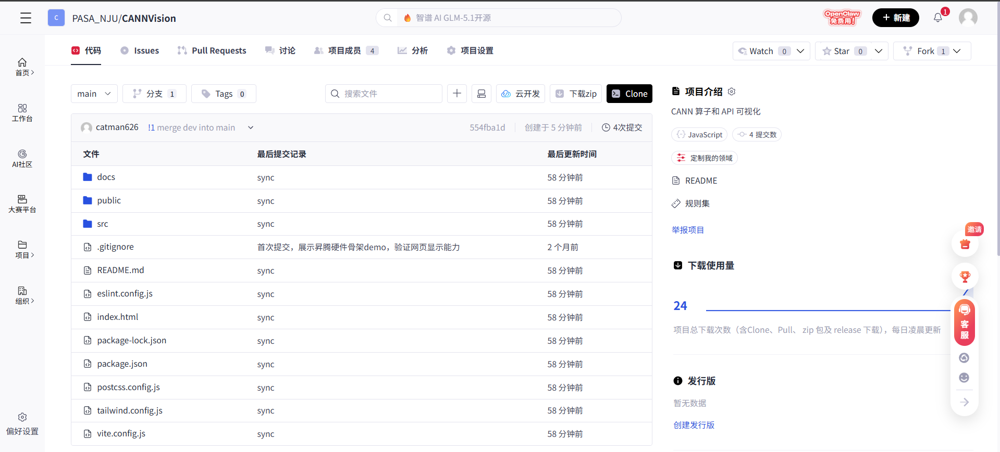
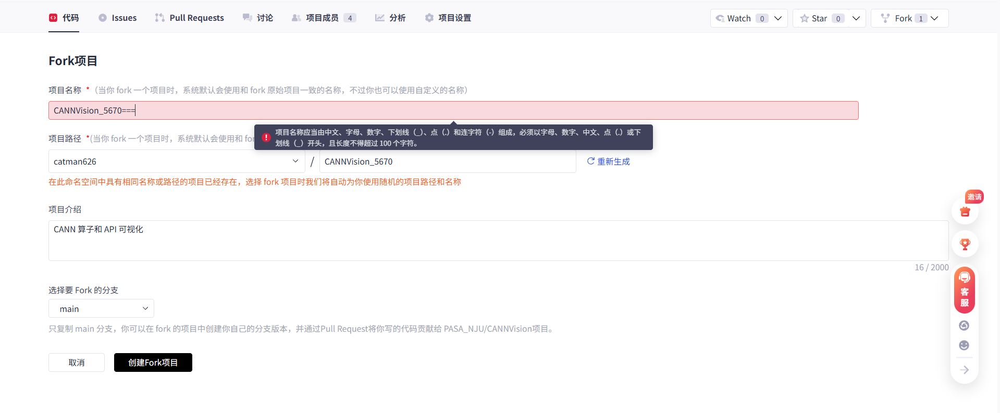
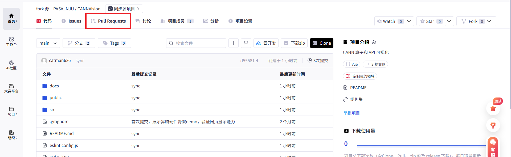
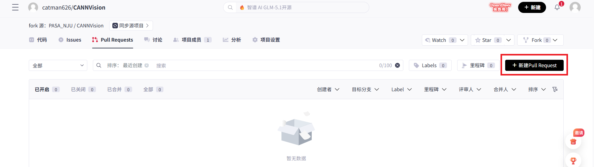
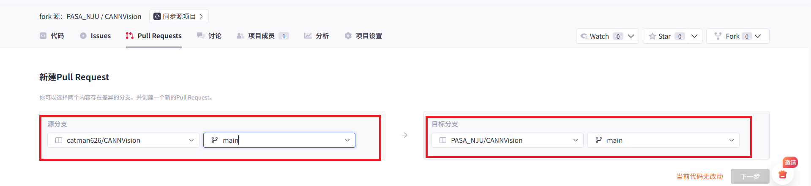

欢迎参与本项目的开发！为了保证团队协作的高效性和代码历史的清晰可读，请所有开发者仔细阅读并遵守以下 Git 开发与贡献工作流。

## 1. 环境配置

在开始开发之前，请确保您的本地环境符合以下要求：

- **操作系统**：推荐使用 Linux / macOS 环境（Windows 用户建议使用 WSL2）。
    
- **运行环境**：Node.js 版本 **20.11.0**。
    
- **依赖安装**：在 Clone 项目之后，请在项目根目录下运行 `npm install` 安装相关依赖。
    
    - _注：如果启动或编译时提示缺少底层 C++ 库或其他系统级依赖，请根据报错信息使用对应的包管理器（如 `apt` 或 `yum`）进行安装。_
        

## 2. Fork 与克隆仓库

我们采用经典的 **Fork & Pull Request** 工作流，确保主仓库的安全与稳定。

### 2.1 Fork 仓库

1. 登录 GitCode，访问团队主仓库 `pasa_NJU/<项目名>`。
    
2. 点击页面右上角的 **Fork** 按钮，将仓库复制一份到您个人的名下（即 `<your-username>/<项目名>`）。
    



    

### 2.2 Clone 到本地

将您个人名下的仓库克隆到本地进行开发：

```Bash
git clone <your-repo-url>  # 替换为您自己 fork 出来的仓库地址
cd <项目名>
```

### 2.3 配置上游仓库 (Upstream) 【重要】

为了能够随时拉取团队主仓库的最新代码，您需要将 `pasa_NJU` 的主仓库配置为本地的“上游”（upstream）：

```Bash
# 添加团队主仓库作为 upstream
git remote add upstream <pasa_NJU-repo-url>

# 查看是否配置成功（应同时包含 origin 和 upstream）
git remote -v
```

## 3. 分支管理与开发

**【严格禁止】直接在 `main` 或 `master` 分支上直接进行开发和提交！**

### 3.1 创建特性分支

每次开发新功能或修复 Bug 时，请基于最新的主分支创建一个新的特性分支：

```Bash
# 确保本地主分支是最新状态
git checkout main
git pull upstream main

# 创建并切换到新分支 (建议命名格式：类型/简短描述，例如 feat/add-visualizer 或 fix/memory-leak)
git checkout -b <branch-name>
```

### 3.2 代码开发与提交规范

完成本地开发后，进行代码提交。我们建议遵循 [Conventional Commits](https://www.conventionalcommits.org/) 规范，这有助于自动生成日志并快速了解改动意图：

```Bash
git add .
git commit -m "类型(可选作用域): 简短描述"
```

**常用的提交类型（Type）包括：**

- `feat`: 新增功能 (Feature)
    
- `fix`: 修复 Bug
    
- `docs`: 仅修改文档 (Documentation)
    
- `style`: 代码格式调整（不影响代码运行，如空格、分号等）
    
- `refactor`: 代码重构（既不修复 bug 也不添加新功能）
    
- `test`: 添加或修改测试用例
    

_示例：`git commit -m "feat: 完成 vector 算子的内存状态模拟"`_

## 4. 同步最新代码与解决冲突

在您的代码准备推送到远程之前，**必须**先拉取团队主仓库的最新代码，以防别人已经合并了新功能导致冲突。

```Bash
# 拉取主仓库的最新变动
git fetch upstream

# 将主仓库的最新 main 分支合并到你当前的开发分支
# （推荐使用 rebase 保持提交历史整洁，如果不熟悉 rebase，也可以使用 git merge upstream/main）
git rebase upstream/main
```

_如果在 rebase 或 merge 过程中出现冲突（Conflict），请打开编辑器解决冲突文件后，执行 `git add .` 和 `git rebase --continue`。_

## 5. 推送代码到个人仓库

确保代码同步且无冲突后，将新建的分支推送到您 **个人（origin）** 的远程仓库：

```Bash
git push origin <branch-name>
```

## 6. 提交 Pull Request (PR)

代码推送到个人远程仓库后，您就可以向团队主仓库发起合并请求了。

1. 进入您的个人仓库页面，系统通常会提示您有一个刚刚推送的分支，点击 **Compare & pull request**。或者手动进入 Pull Request 页面点击新建。
    





    
2. **确认分支方向**：
    
    - **目标分支 (Base)**：`pasa_NJU/仓库名` 的 `main` 分支
        
    - **源分支 (Compare)**：`<your-username>/仓库名` 的 `<branch-name>` 分支
        
        ![[pr3.png]]
        
3. **填写 PR 信息**：
    
    - **标题**：简明扼要地概括此 PR 的目的（建议复用 commit 规范，如 `feat: 新增 Exp 算子支持`）。
        
    - **描述**：详细说明此 PR 解决了什么问题、实现了什么功能，以及测试情况。如果关联了特定的 Issue，请写上 `Fixes #123` 或 `Resolves #456`。
        
4. 点击 **Create pull request** 提交。
    

## 7. Code Review 与合并

1. PR 提交后，请我们进行 Code Review（代码审查）。
    
2. 根据 Review 意见，您可能需要在本地继续修改代码。修改后只需 `git add`、`git commit`，并再次 `git push origin <branch-name>`，新的提交会自动追加到当前的 PR 中，**无需新建 PR**。
    
3. 审查通过并由管理员合并到主仓库后，您的贡献就正式生效了！您可以删除本地和个人的特性分支，并准备迎接下一个任务。

